# Full Project Deduplication Plan

Consolidate duplicated logic across `api/`, `web/`, and `api.Tests/` into small domain-scoped static helpers (following the existing `ResolutionStateMapper` pattern), delivered in behavior-preserving commits.

## Guiding principles

- **Precedent:** [`api/Utilities/Resolution/ResolutionStateMapper.cs`](../api/Utilities/Resolution/ResolutionStateMapper.cs) — small static class, one concern, used by 2+ call sites. Already done.
- **Avoid:** Monolithic cross-entity mappers (e.g. a single `EntityApiStringMapper` or broad `NotificationFactory`). Prefer **domain-scoped** names instead.
- **Constraints:** No public API changes, no DB changes, preserve NotFound-over-Forbidden obfuscation, verify each batch with `dotnet build`, `dotnet test`, `npm run build`.

```mermaid
flowchart LR
  subgraph done [Already consolidated]
    RSM[ResolutionStateMapper]
  end
  subgraph backend [Backend batches 1-4]
    RAS[ReportApiStrings]
    CAS[ClaimApiStrings]
    NDL[ReportDeepLinkBuilder]
    NEB[NotificationEntityBuilder]
    CPA[ChatParticipantAuthorization]
    CAA[ClaimAccessAuthorization]
    RFP[ReportFormParserCore]
    UP[UploadPresignHelpers]
  end
  subgraph frontend [Frontend batches 5-8]
    AES[ApiErrorService extensions]
    DL[DomainLabelService]
    CD[ConfirmDialogComponent]
    RFH[ReportFormHelpers]
  end
  subgraph tests [Tests batch 9]
    HTH[HttpTestHelpers]
  end
  done --> backend --> frontend --> tests
```



---

## Batch 1 — Report & claim API string mappers (backend)

**Problem:** Identical enum→snake_case switches in 5 services (~25 call sites).

| Current location | Methods |
| ---------------- | ------- |
| `ReportService.cs` | `ToApiType`, `ToApiStatus`, `TryParseReportType`, `ParseStatusFilter` |
| `BrowseService.cs` | `ToApiType`, `ToApiStatus`, `TryParseReportType` |
| `ClaimService.cs` | `MapReportType`, `MapReportStatus`, `MapClaimStatus` |
| `ChatService.cs` | same 3 mappers |
| `ModerationService.cs` | inline type switch + `MapStatus` |

**Add:**

- `api/Utilities/Reports/ReportApiStrings.cs` — `ToType`, `ToStatus`, `TryParseType`, `ParseStatusFilter`
- `api/Utilities/Claims/ClaimApiStrings.cs` — `ToStatus`

**Replace** private copies in all 5 services; delete local methods.

**Note:** Unify `TryParseReportType` to always use `.Trim().ToLowerInvariant()` (BrowseService behavior).

**Commit:** `refactor(api): extract report and claim API string mappers`

---

## Batch 2 — Notification entity + deep link helpers (backend)

**Problem:** 3 identical `CreateNotification` methods + 3 inline constructions; 3 identical `BuildReportDeepLink` implementations.

| Current location | Pattern |
| ---------------- | ------- |
| `ClaimService.cs` | `CreateNotification` (5 calls), `BuildReportDeepLink` (2 calls) |
| `ResolutionService.cs` | same (4 + 4 calls) |
| `ChatService.cs` | `CreateNotification` (1 call) |
| `ClaimCleanupService.cs` | inline `new Notification` + `BuildReportDeepLink` |
| `ModerationService.cs` | inline `new Notification` (2×) — uses `/my/reports/{id}` |

**Add:**

- `api/Utilities/Notifications/ReportDeepLinkBuilder.cs` — `ForPublicReport(Report)`, `ForMyReport(Guid reportId)`
- `api/Utilities/Notifications/NotificationEntityBuilder.cs` — `Create(userId, type, payload, createdAt)` (always sets `Id = Guid.NewGuid()`)

**Replace** all 13 notification creations and 7 deep-link usages. Moderation keeps `/my/reports/` via `ForMyReport`.

**Commit:** `refactor(api): extract notification entity and deep link builders`

---

## Batch 3 — Participant & access authorization helpers (backend)

**Problem:** 3 identical `IsParticipant` copies; repeated reporter/claimant role blocks.

**Add:**

- `api/Utilities/Chats/ChatParticipantAuthorization.cs` — `IsParticipant(ChatThread, userId)`, optional EF `AnyAsync` helper for hub
- `api/Utilities/Claims/ClaimAccessAuthorization.cs` — `IsReporterOrClaimant`, `IsReporter`, `GetCounterpartyId`

**Replace in:** ChatService, ChatAttachmentAttachService, ChatAttachmentPresignService, ChatHub, ResolutionService, ClaimService, ClaimPhotoPresignService.

**Commit:** `refactor(api): extract chat and claim access authorization helpers`

---

## Batch 4 — EF query extensions, form parsers, upload/pagination (backend)

### 4a — EF Include extensions

**Add:**

- `api/Data/Extensions/ReportQueryExtensions.cs` — `WithBrowseSummaryIncludes()`, `WithPublicDetailIncludes()`, `WithOwnerDetailIncludes()`
- `api/Data/Extensions/ClaimQueryExtensions.cs` — `WithReportOnly()`, `WithResolutionDetail()`

**Replace** repeated Include chains in BrowseService, ReportService, ModerationService, ClaimService, ResolutionService.

### 4b — Report form parser core

**Add:** `api/Services/Reports/ReportFormParserCore.cs` — shared `ReadReportJsonAsync`, photo count check, FluentValidation error grouping.

**Refactor:** `ReportCreateFormParser.cs` + `ReportUpdateFormParser.cs` to thin wrappers.

### 4c — Upload/presign plumbing

**Add:**

- `api/Utilities/Uploads/PresignConstants.cs` — 5-min lifetime
- `api/Utilities/Uploads/StorageKeyResolver.cs` — thumbnail fallback via `ExistsAsync`
- `api/Utilities/Reports/ReportPhotoUrlMapper.cs` — `PhotosPrivate` thumbnail URL logic (BrowseService + ReportService)

### 4d — Pagination + validator AddError

**Add:** `api/Utilities/Common/Pagination.cs` — `BuildResponse<T>(items, page, pageSize, totalCount)`

**Fix:** duplicate `AddError` in `ReportFieldValidators.cs` — single file-scoped helper.

**Commits:** split into 2 if diff is large:

- `refactor(api): extract EF query include extensions`
- `refactor(api): dedupe form parsers, upload helpers, and pagination`

---

## Batch 5 — Frontend error handling (web)

**Problem:** 8 components copy `parseError`/`handleError` despite existing `ApiErrorService`.

**Extend `ApiErrorService`:**

```typescript
extractBody(error: unknown): ApiErrorBody | null
messageFromHttpError(error: unknown, overrides?: Partial<Record<number, string>>): string
formErrorsFromHttpError(error: unknown): { summary: string; fieldErrors: Record<string, string[]> }
```

**Replace private copies in:** my-claims, report-claims-section, claim-resolution-actions, report-detail, report-form, claim-form, moderation-review, categories-admin.

**Keep local:** `login.component.ts` (429/captcha behavior).

**Commit:** `refactor(web): centralize API error handling in ApiErrorService`

---

## Batch 6 — Frontend status labels & domain labels (web)

**Add:** `web/src/app/i18n/domain-label.service.ts`

- `reportType(type)`, `reportStatus(status)`, `reportBadgeVariant(status, context: 'public' | 'owner')`
- `claimStatus(status)`, `claimBadgeVariant(status)`

**Replace** duplicated `statusLabel`/`badgeVariant`/`typeLabel`/`governorateLabel` wrappers in 10+ components. Fix browse/public-detail to use full owner badge map where appropriate (currently only 2-state).

**Add:** `web/src/app/shared/models/pagination.models.ts` — generic `PaginatedResponse<T>`; replace `PaginatedClaimsResponse` in `claim.models.ts`.

**Commit:** `refactor(web): extract domain label and pagination helpers`

---

## Batch 7 — Resolution gating & approved-claim lookup (web)

**Problem:** Duplicated `loadApprovedClaim`/`showResolutionActions` in public-report-detail and report-detail. Claimant path uses `getMine(1, 100)` — can miss claims beyond first page.

**Add:**

- `web/src/app/claims/resolution/resolution.helpers.ts` — pure `shouldLoadApprovedClaim`, `showResolutionActions`
- Extend `claim.service.ts` with `findApprovedClaimForReport(reportId)` — reporter uses `getByReport`; claimant paginates `getMine` until match or empty page

**Remove** duplicated methods from both report detail components.

**Commit:** `fix(web): unify approved-claim lookup for resolution UI`

---

## Batch 8 — Confirm dialog, photo loader, report form helpers (web)

### 8a — Confirm dialog component

**Add:** `web/src/app/shared/ui/confirm-dialog/` — title, body, confirm/cancel, loading, variant.

**Replace** inline dialogs in report-claims-section and claim-resolution-actions.

Withdraw dialog in report-detail stays local (contains form).

### 8b — Photo presign loader

**Add:** `web/src/app/uploads/photo-loader.util.ts` + shared `PresignUrlResponse` type.

**Replace** identical `loadPhotos`/`updatePhoto` in report-detail and moderation-review.

### 8c — Report form shared logic

**Add:** `web/src/app/reports/shared/report-form.helpers.ts` — validators, reward toggling, category field payload.

**Replace** duplicated blocks in report-form and report-detail resubmit section.

**Commit:** `refactor(web): extract confirm dialog, photo loader, and report form helpers`

---

## Batch 9 — Test helper consolidation (api.Tests)

### 9a — HttpTestHelpers

**Add:** `api.Tests/Infrastructure/HttpTestHelpers.cs` — `ReadErrorAsync`, `ReadJsonAsync<T>`.

**Remove** copies from ClaimTestHelpers, BrowseTestHelpers, OtpSendTestContext; remove passthroughs from ChatTestHelpers, ResolutionTestHelpers, ReportTestContext.

### 9b — Admin test helpers

**Add:** `LoginAsAdminAsync(ReportTestContext)` to shared helper (extract from 4 private copies).

**Remove** ResolutionTestHelpers auth passthrough wrappers.

### 9c — Folder casing fix

Fix `api.tests` vs `api.Tests` casing mismatch (Windows on-disk vs git index). Two-step `git mv` to normalize before Linux/Render deploys.

**Commit:** `refactor(tests): centralize HTTP and admin test helpers`

---

## Verification gates (every batch)

| Gate | Command |
| ---- | ------- |
| Backend compile | `dotnet build Amanah.slnx` |
| Backend tests | `dotnet test api.Tests/Amanah.Api.Tests.csproj` |
| Frontend compile | `npm run build` (in `web/`) |

## Manual smoke (after batches 7–8)

- Resolution confirm/cancel on `/lost/{id}` and `/my/reports/{id}`
- Claim approve/reject dialogs
- Report create + resubmit
- Browse list badge variants
- Moderation photo load

## Out of scope

- Generated TS from C# contracts
- MediatR / repository layer
- Lazy routes / OnPush conversion
- Merging `ReportDetail` and `PublicReportDetail` models (intentional API split)
