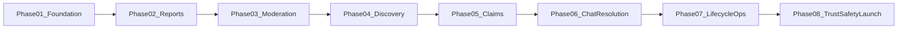

# Amanah — Implementation Phases

This directory breaks [SPEC.md](../SPEC.md) into **8 testable implementation phases**. Each phase delivers a coherent, verifiable slice (API + UI + tests) and references explicit SPEC sections.

**Constraints:**
- Each phase is a **testable module** — not required to be a full user-facing product slice alone
- Scope covers **full v1** (SPEC sections 1–21)
- External integrations use a **real provider when the phase needs it**
- Use [_TEMPLATE.md](./_TEMPLATE.md) when authoring new phase docs

---

## Phase dependency map

Phases are strictly sequential. Do not skip ahead — later phases depend on entities, services, and permissions introduced earlier.

---

## Phase index

| Phase | Doc | Goal | Key exit criteria |
| ----- | --- | ---- | ---------------- |
| 01 | [PHASE-01-platform-foundation.md](./PHASE-01-platform-foundation.md) | Monorepo, auth, DB schema, seeds, static pages | Section 15.7 |
| 02 | [PHASE-02-report-submission.md](./PHASE-02-report-submission.md) | Lost/found submission, uploads, quotas | Section 15.1 |
| 03 | [PHASE-03-admin-moderation.md](./PHASE-03-admin-moderation.md) | Admin queue, approve/reject, resubmit, notifications | Section 15.2 (except expiry) |
| 04 | [PHASE-04-browse-discovery.md](./PHASE-04-browse-discovery.md) | Public browse, search, filters, detail pages | Section 15.3 |
| 05 | [PHASE-05-claims-verification.md](./PHASE-05-claims-verification.md) | Claim lifecycle, reporter review, attempt limits | Section 15.4 (except timeout job) |
| 06 | [PHASE-06-chat-resolution-notifications.md](./PHASE-06-chat-resolution-notifications.md) | SignalR chat, mutual resolution, full notifications | Section 15.5, Section 15.9 |
| 07 | [PHASE-07-lifecycle-retention.md](./PHASE-07-lifecycle-retention.md) | Expiry, retention jobs, account deletion | Section 15.2 expiry, Section 15.5 retention |
| 08 | [PHASE-08-trust-safety-launch.md](./PHASE-08-trust-safety-launch.md) | Abuse, enforcement, permissions audit, launch | Section 15.6, Section 15.8, full Section 15 |

---

## SPEC section → phase mapping

| SPEC sections | Phase |
| ------------- | ----- |
| Section 16–18, Section 21 (foundation), Section 3, Section 5.1, Section 5.8, Section 11 (baseline) | 01 |
| Section 4.1–4.2, Section 5.2–5.4, Section 19, Section 4.8 (partial) | 02 |
| Section 4.3, Section 5.5, Section 8 (moderation), Section 5.7 (email + report events) | 03 |
| Section 4.4, Section 16 (search), Section 4.8 (partial) | 04 |
| Section 6, Section 4.5, Section 4.8 (claims) | 05 |
| Section 4.6, Section 5.6–5.7 (full), Section 7.3, Section 20.1 | 06 |
| Section 4.7, Section 12, Section 5.1 (deletion), Section 21 (jobs), Section 6.3 (timeout job) | 07 |
| Section 7, Section 8 (enforcement), Section 9 (full audit), Section 10, Section 11, Section 13, Section 15 (full) | 08 |

**Context only (not implementation work):** Section 1–2 (problem/vision), Section 13 (risks — verified at launch in Phase 08).

---

## Deferred decisions (Section 14) by phase

| Item | Resolve before phase |
| ---- | -------------------- |
| OTP / SMS provider | 01 |
| API error contract appendix | 01 |
| Transactional email provider | 03 |
| SignalR event/payload contract | 06 |
| Domain name | 08 |

---

## Cross-phase rules

1. **Permissions (Section 9):** Enforce matrix rows incrementally — each phase doc lists the rows required before that phase is done. Do not defer all permission work to Phase 08.

2. **Notifications (Section 5.7):** Phase 03 introduces the notification center. Later phases add event types only.

3. **Search column:** Phase 02 writes `normalizedSearchText` on every report create/update. Phase 04 reads it — no backfill needed if Phase 02 is complete.

4. **Chat thread placeholder:** Phase 05 creates `ChatThread` on claim approval. Messaging is inert until Phase 06.

5. **Background jobs:** Expiry, timeout, and retention jobs ship in Phase 07. Use configurable intervals and admin test triggers for CI (documented in Phase 05 and 07).

6. **Cleanup services:** Phase 07 introduces `ReportLifecycleService`, `ClaimCleanupService`, `RetentionService`. Phase 08 ban/takedown calls these — do not duplicate logic.

---

## Phase document structure

Every `PHASE-0N-*.md` follows [_TEMPLATE.md](./_TEMPLATE.md):

1. Summary
2. SPEC references
3. Prerequisites
4. Deliverables (API, UI, DB, infrastructure)
5. Permissions (Section 9)
6. Notifications (Section 5.7)
7. Out of scope
8. Acceptance criteria (from Section 15)
9. Definition of done (tests + smoke checklist)

---

## Getting started

1. Read [SPEC.md](../SPEC.md) for product and technical requirements
2. Resolve Section 14 prerequisites for Phase 01 (SMS provider, API error contract)
3. Implement Phase 01; verify all acceptance criteria and the definition-of-done checklist
4. Proceed sequentially through Phase 08
